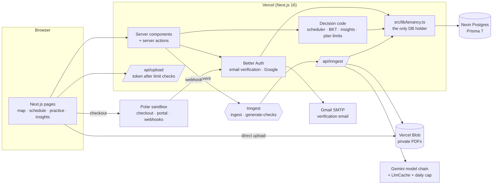

# Architecture

## The line the product rests on

**The model writes the map and the questions; code decides what you know.**

| Model decides | Code decides |
|---|---|
| Which concepts a syllabus contains | Whether the graph is acyclic, which edges survive |
| Prerequisite edges and their rationales | What day each topic is studied |
| Practice questions and a proposed key | Whether that key is trusted (blind second solve must agree) |
| Which concept an exam question tests | Exam weight per concept (marks share) |
| — | Mastery (Bayesian Knowledge Tracing) |
| — | When to contradict a student (≥ 3 answers, ≥ 60 % wrong, marked done) |
| — | Plan limits |

`npm run verify` enforces it from the import graph: `src/lib/{mastery,schedule,graph}` and
`src/lib/plans.ts` may not reach `@google/genai` or `src/lib/llm`, even transitively.

## Jobs

**ingest-document** (`document/uploaded`) — five memoised steps, each writing its index to `IngestJob`:

1. read — fetch the private blob, check `%PDF-`, hash it
2. extract — the only model call (syllabus → concepts/edges/assessments; past paper → question→concept matches)
3. validate — Zod + graph checks, or past-paper id checks
4. save — one transaction; dates parsed in code
5. schedule — rebuild; then, for a syllabus, emit `course/map-ready`

**generate-checks** (`course/map-ready`) — concepts most-depended-on first, in batches of 10:
generate → shuffle options in code → blind solve → keep agreement → save.

## Model calls

`generateJsonCached` → content-addressed `LlmCache` (sha256 of provider + chain + prompt + schema + input bytes)
→ `GlobalCounter` daily cap → `GeminiProvider` chain `3.6-flash → 3.8-flash → 3.7-flash → 3.5-flash`
with backoff honouring `retryDelay`. When every model is busy the job step throws `RetryAfterError` and Inngest
waits without holding a function open.

## Tenancy

Every product table carries `workspaceId`. Only `src/lib/tenancy.ts` (and Better Auth's adapter, and the
workspace-less LLM cache) import the Prisma client. Functions take a `WorkspaceContext` minted from an
authenticated session; background jobs mint one from the job's or course's own row. A record in another
workspace reads as `null` → 404.
